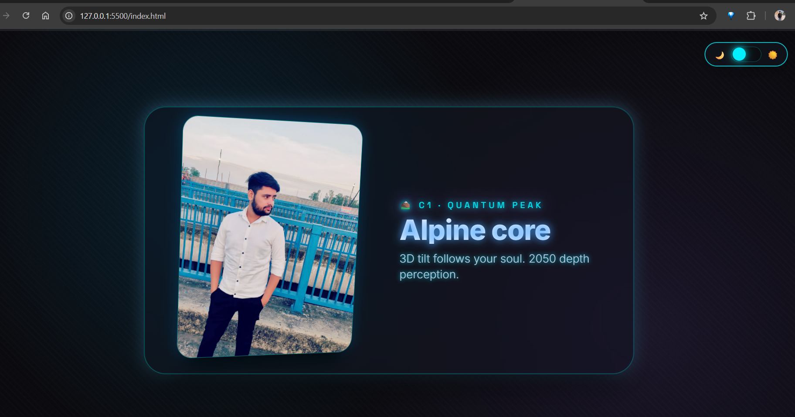

# SCROLL CORE

A futuristic, scroll‑driven 3D storytelling website. Smooth parallax, glassmorphism cards, dynamic theme switching, and a cinematic preloader – all optimized for both desktop and mobile.

 <!-- Replace with actual screenshot -->

## ✨ Features

- **Lenis Smooth Scroll** – Butter‑smooth scrolling with native‑like feel.
- **3D Image Tilt** – Images rotate in 3D space based on scroll position.
- **Theme Toggle** – Seamless switch between dark neon and soft light themes (CSS variables).
- **Cinematic Preloader** – Full‑screen glassmorphism loader with animated logo.
- **Top Progress Bar** – Thin, glowing indicator synced with Lenis scroll.
- **Mobile Optimized** – Adjusted animations and touch multiplier for fluid 60fps on phones.
- **Camera Lens Ring (Mobile)** – Subtle decorative ring that stays centered while scrolling.
- **Fully Responsive** – Works on all screen sizes.

## 🛠️ Tech Stack

- HTML5 / CSS3
- JavaScript (ES6+)
- [Lenis](https://github.com/studio-freight/lenis) – smooth scroll
- [GSAP](https://greensock.com/gsap/) – ScrollTrigger + 3D animations
- Google Fonts: [Inter](https://fonts.google.com/specimen/Inter), [Space Grotesk](https://fonts.google.com/specimen/Space+Grotesk)

## 🚀 Live Demo

[View Live Demo](#) <!-- Replace with your URL -->

***

## 🎨 Customization
### Colors & Themes
- All theme colors are controlled by CSS variables in `:root` (dark) and `body.light-theme` (light). Adjust them to match your brand.

### Images
- Replace the images in the `images2/` folder and update the `` paths in the HTML. The aspect ratio is 4:5 – use similar dimensions for best results.

### 3D Animation Intensity
- GSAP animations are defined inside the `<script>` tag. Modify `dirY`, `dirX`, `scrub` values, or angles to change the tilt effect.

### Mobile‑Specific Settings
- Mobile optimizations (touch multiplier, scrub reduction, lens ring) are controlled via `window.matchMedia` and CSS media queries. Adjust breakpoints in the script and CSS.

### 📱 Mobile Experience
- On devices smaller than 700px:
  - 3D rotation is simplified (rotateY only, lower scrub).
  - Wrapper rotation is disabled.
  - A subtle camera‑lens ring appears fixed in the center.
  - Touch multiplier reduced to `0.8` for ultra‑smooth response.

***

## 🤝 Credits
- Lenis – smooth scrolling

- GSAP – ScrollTrigger and animations

- Google Fonts – Inter and Space Grotesk

- Icons and emojis from Unicode

